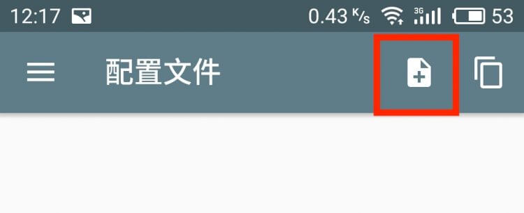
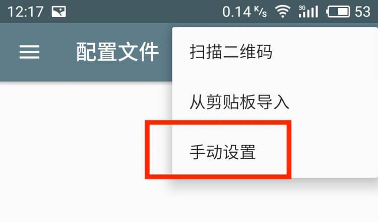
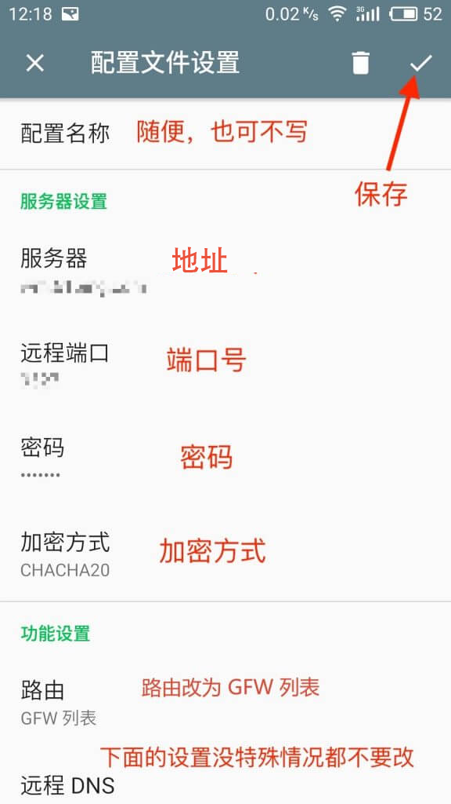
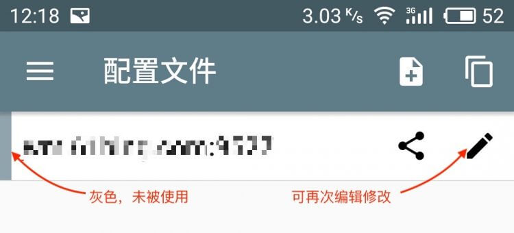
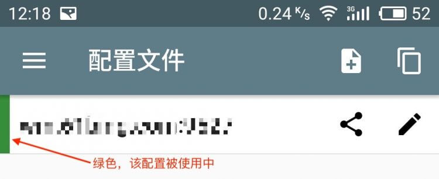
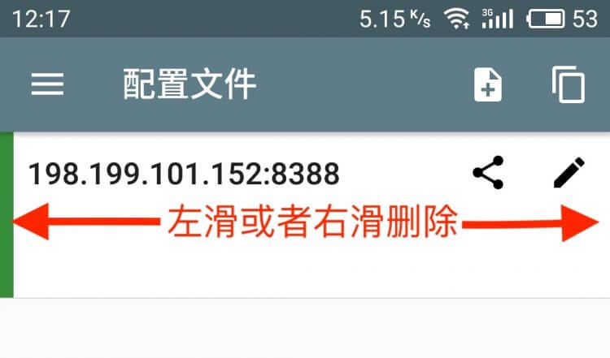
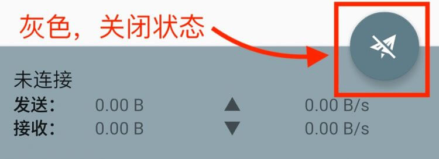
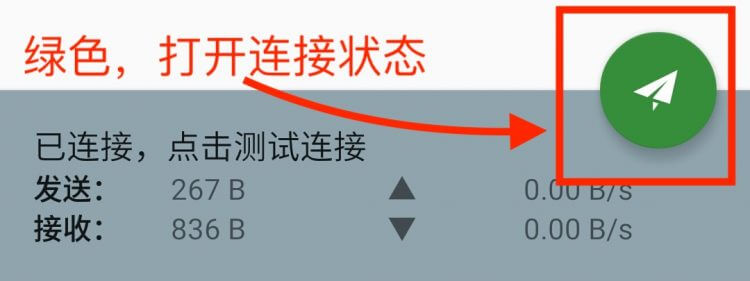
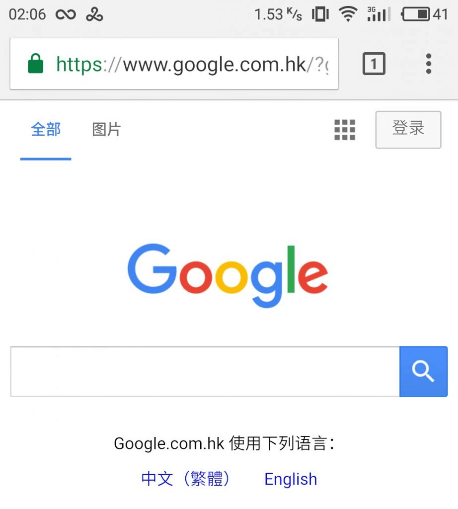

# 安卓使用教程

<!-- > An awesome project. -->

#### 1. 下载安卓版本 

首先，下载安卓版的客户端。

地址一：<a href="https://www.lanzous.com/i3xszaj" target="_blank">点击下载</a> 

地址二：<a href="https://sameapk.com/shadowsocks/#down" target="_blank">点击下载</a> （有点慢）

下载其他国外安卓App的网站：<a href="https://sameapk.com" target="_blank">sameapk.com</a>  （不代理，访问有点慢哦！）

#### 2. 安装  

如果是手机下载的，可以用手机里的文件管理器，找到该 APK安装。如果是电脑下载的，请导入到手机里进行安装。安装完毕手机桌面会出现一个叫 “影梭” 的 APP 。 

#### 3. 导入配置 

##### 3.1 第一种方法

点击购买的账号二维码，会出现个新页面，再点击二维码，添加到app上。（如果不行，尝试第二种方法）

##### 3.2 第二种方法

点击右上角的加号，选择 "手动设置"。

 

##### 3.3 填写配置

进入添加配置的设置界面后，按照下图所示，根据你购买的账号配置，依次填写。填写完毕后，点击右上角的对号✔️保存。

重要：关闭 ipv6路由

##### 3.4 选中新加配置

添加完毕返回到软件首页，注意看，首页有了你新添加的配置,配置的最左侧是灰色的，说明未被使用，点击配置，最左侧变为绿色，说明使用该配置（如下图）。同时，如果发现配置填写错误，可以点击右侧的小铅笔再次编辑修改。

 

##### 3.5 影梭首页和删除默认配置 

打开影梭，你看到的首页是这个样子。它会默认一个配置，这个配置是没有用的，可以左滑或者右滑删除掉。 

##### 3.6 启动和关闭。

右下角的小飞机即为开关按钮，如果处于灰色状态，说明是关闭中；可点击打开连接，打开即为绿色。

 

#### 4. 测试是否连接成功

打开浏览器看看是否能上谷歌 https://www.google.com.hk 了。（强烈建议不要使用国产浏览器，尤其是华为小米自带的浏览器，此处推荐 Chrome）。

最后，恭喜你，自由了。

如果不行，仔细看下教程，是不是哪里操作不对。

如果还是不能解决，请联系客服：[客服](/?id=联系客服)

