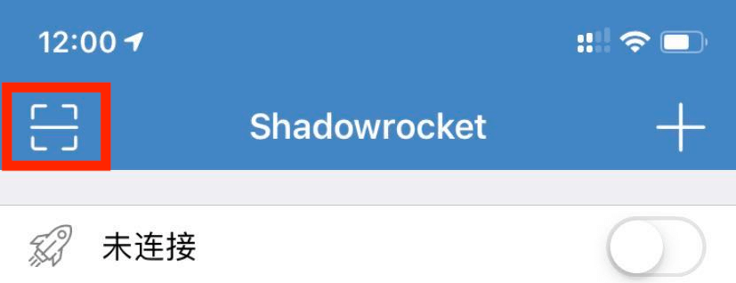
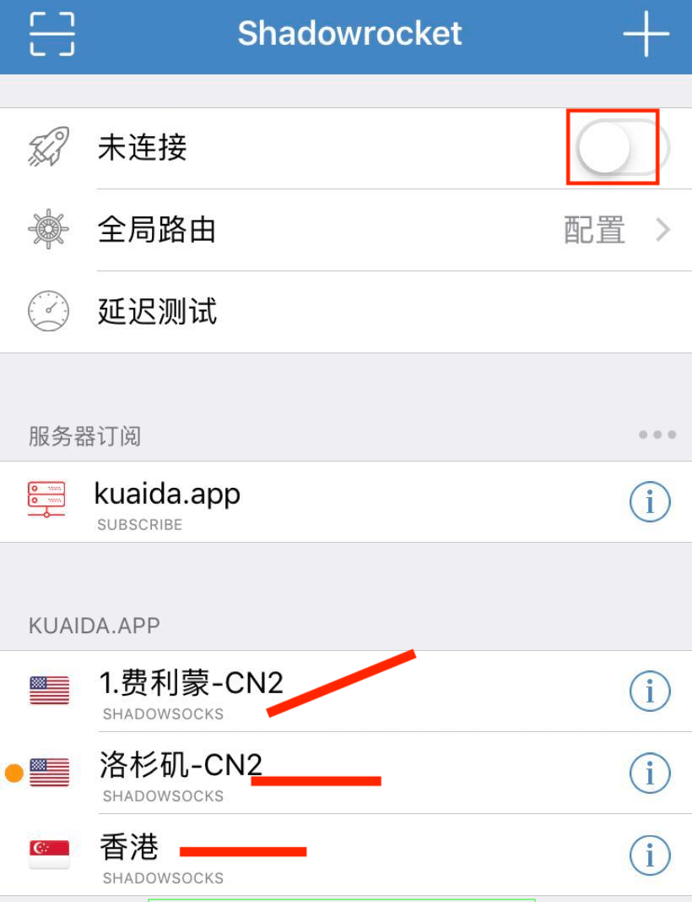

# ios使用教程

<!-- > An awesome project. -->

#### 1. 下载

ios用户需要先购买账号，

然后查看首页公告里的【ios app下载】 (不购买账号，安装软件也无法使用哦)。

#### 2. 安装

方法1:

重要：点击“在线安装”后等会，安装完成网页会显示个Apple ID账号，第一次打开软件需要登陆这个Apple ID，千万不要使用网页显示的Apple ID登陆到自己的icloud哦。	

说明：软件正常使用后，如果打开自己的AppStore显示英文的话，点击AppStore右上角的头像，点【Sign Out】退出，再登陆自己的Apple ID即可。

方法2:

打开手机应用App Store，点击右上角头像退出账号，然后用网页显示的Apple ID登陆，登陆成功后，卸载刚才下载的小火煎app，然后打开 https://itunes.apple.com/app/id932747118 这个链接下载，下载后如果没什么问题，记得App Store退出刚登陆的账号，登陆自己的。

#### 3. 导入配置 

##### 3.1 第一种方法（推荐）

订阅的方式添加账号，[订阅教程](/help/?id=什么是订阅链接？)

##### 3.2 第二种方法

点击购买的账号二维码，会出现个新页面，再点击二维码，添加到app上。（如果不行，尝试第二种方法）

##### 3.3 第三种方法

点击软件左上角的框框，扫码添加账号。（扫你购买的二维码）

#### 4. 启动和关闭。

任意选择一个节点（节点前面的圆点代表选中节点），点击“未连接”后面的开关，开启代理即可。

第一次会显示一个弹窗，点“Allow”。

说明：

1. 点击节点后的“感叹号”，可以编辑节点。
2. “全局路由”一般选择“配置”和“代理”，推荐选项配置，配置的意思是仅需要代理的网站才会代理，国内的网站不代理。代理的意思是所有网站都会代理（相当于“全局代理”）。

#### 5. 测试是否连接成功

打开浏览器看看是否能上谷歌 https://www.google.com.hk 了。（强烈建议不要使用国产浏览器，尤其是华为小米自带的浏览器，此处推荐 Chrome）。

最后，恭喜你，自由了。

如果不行，仔细看下教程，是不是哪里操作不对。

如果还是不能解决，请联系客服：[客服](/?id=联系客服)
