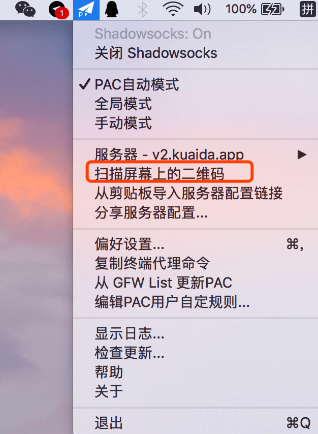

# Mac使用教程

<!-- > An awesome project. -->

#### 1. 下载

首先，下载mac的客户端。

地址一： <a href="https://share.weiyun.com/5crSHoB" target="_blank">点击下载</a>

#### 2. 安装

双击解压压缩包内的文件夹，打开ShadowsocksX-NG。

#### 3. 导入配置 

先切换网页到你购买账号的二维码那里，然后点击电脑任务栏里的角小飞机的图标，选择【扫描屏幕上的二维码】。

其他方法：你也可以复制账号二维码下面的“复制链接”，选择【从剪切板导入服务器配置链接】，还可以选择服务器设置，手动输入账号。

#### 4. 启动和关闭。

点击小飞机图标，选择【打开shadowsocks】即可

#### 5. 测试是否连接成功

打开浏览器看看是否能上谷歌 https://www.google.com.hk

如果能，恭喜你，自由了。

如果不行，仔细看下教程，是不是哪里操作不对，如果是chrome浏览器，到设置 ->高级->代理 ，关闭其他插件代理。

如果还是不能解决，请联系客服：[客服](/?id=联系客服)

