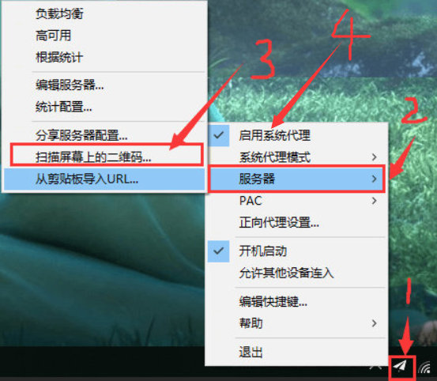

# windows使用教程

#### 1. 下载

首先，下载window的客户端。

地址一：<a href="https://share.weiyun.com/5VvIgr4" target="_blank">点击下载</a> 

#### 2. 安装

解压压缩包内的文件夹（无解压工具，请先安装WinRAR），右击鼠标以管理员方式打开Shadowsocks文件。

电脑右下角会显示个小飞机的图标。

如果提示 <code>.NET Framework版本过低</code>或者<code>shadowsocks已停止工作</code>，需要安装 <a href="https://dotnet.microsoft.com/download/dotnet-framework/net472" target="_blank">.NET Framework 4.7.2</a>，安装后如果软件还是无法打开，请再安装 <a href="https://www.microsoft.com/en-us/download/details.aspx?id=53840" target="_blank">Microsoft Visual C++ 2015 Redistributable (x86)</a>

#### 3. 导入配置 

先切换网页到你购买账号的二维码那里，然后右击电脑右下角小飞机的图标，选择【服务器】->【扫描屏幕上的二维码】。

其他方法：你也可以复制账号二维码下面的“复制链接”，选择【从剪切板导入URL】，还可以编辑服务器，手动输入账号。

#### 4. 启动和关闭。

右击电脑右下角小飞机图标，选择【启动系统代理】即可。如下图的第四步。

#### 5. 测试是否连接成功

打开浏览器看看是否能上谷歌 https://www.google.com.hk 如果能，恭喜你，自由了。

如果不行，仔细看下教程，是不是哪里操作不对。

如果还是不能解决，请联系客服：[客服](/?id=联系客服)

#### 常见问题

##### 还是不用使用？

先打开ie浏览器看能不能打开谷歌，如果不能，请再看照教程做操作一次。

如果能打开，但其他浏览器打不开谷歌，比如Google浏览器，到设置 ->高级->代理 ，关闭其他插件代理。

已知部分计算机上，中文的宽带连接名称可能会有问题。请尝试在 控制面板\网络和 Internet\网络连接 中将你的“本地连接”（可能是本地连接 2、3、4……）改名为纯英文的（比如 Network），然后用英文的重新拨号，拨完后退出SS客户端，重新打开。

另外，如果在未拨号的情况下启动SS客户端，然后再拨号，也可能会有问题。

##### 服务器自动切换
* 负载均衡：随机选择服务器
* 高可用：根据延迟和丢包率自动选择服务器
* 累计丢包率：通过定时 ping 来测速和选择。如果要使用本功能，请打开菜单里的统计可用性。

